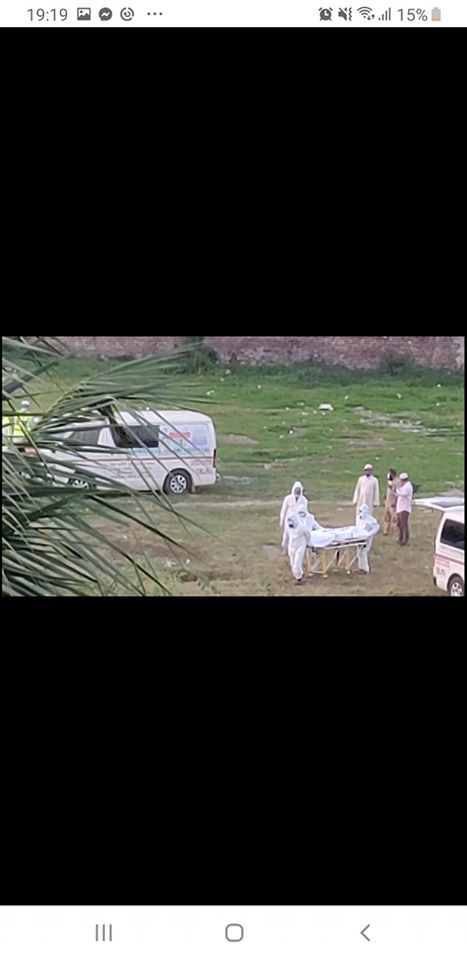

<h3>Post Link</h3>
<a href="https://www.facebook.com/685352578/posts/10158187220332579/">Burial At Taltola Cemetary</a>
<h3>Post Time</h3>

March 29, 11:40 PM

নীচের ছবিগুলো আজ ভোরের, তালতলা গোরস্তানে। চুপিচুপি করোনা রোগীর কবর দিয়ে যাওয়া ভিডিও থেকে নেওয়া। মহিলা কয়েকদিন সর্দিজ্বর, গলা ব্যথা ও শ্বাসকষ্টে ভুগে রাতে মারা যায়। টেস্টের জন্য বলেও কোন টেস্ট করাতে পারে নাই। মারা গেলে কর্তৃপক্ষ গিয়ে তাকে এভাবে এখানে মাটি দিয়ে যায়। ঘটনা ঢাকার মোহাম্মদপুর।

ঢাকার কুর্মিটোলা হাসপাতালে একই উপসর্গ নিয়ে গতকাল মারা গেছে আরেক যুবক। গতকাল মানিকগঞ্জে সর্দিজ্বর, শ্বাসকষ্ট ও গলা ব্যথা নিয়ে মারা গেছে এক মহিলা। একই দিনে ময়মনসিংহ, জামালপুর ও কিশোরগঞ্জে একজন করে মারা গেছে। গতকাল লালমনিরহাট, বগুরা ও নওগাঁর (রাজশাহী মেডিকেলে) একজন করে মারা গেছেন সর্দিজ্বর, শ্বাসকষ্ট নিয়ে। 

বরিশালে তিনজন, খুলনায় একজন, পটুয়াখালীতে দুইজন সর্দিজ্বর, শ্বাসকষ্ট নিয়ে মারা গেছেন।অথচ আমাদের বিটিভি প্রতিনিধি ফ্লোরা বলেন দেশে কোন করোনা রোগী নাই।
লাশ চুরি করে দাফন করলে রোগী থাকে কী করে? 

