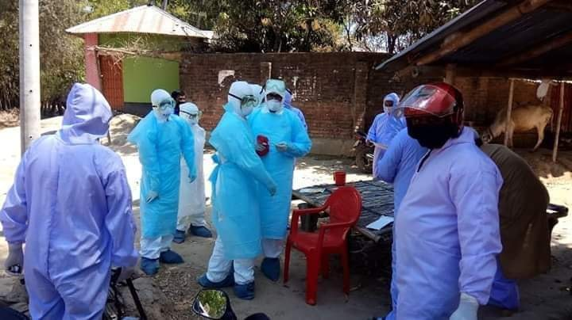

<h3>Post Link</h3>
<a href="https://www.facebook.com/groups/700606854029175/permalink/705715166851677/">Atiqua Roma Facebook Post</a>

<h3>Post Time</h3>

30 March, 9:15 PM (GMT+6)

<h2>বিরামপুরে করোনা উপসর্গে মৃতব্যক্তির দাফন সম্পন্ন</h2>

কুমিল্লা থেকে জ্বর, সর্দি, শ্বাসকষ্ট, গলাব্যথা আক্রান্ত হয়ে দিনাজপুরের বিরামপুর উপজেলার জোতবানী ইউনিয়নের তপসী গ্রামের বাড়িতে এসে মারা গেছেন ৩২ বছর বয়সের এক ব্যক্তি। তিনি জ্বর, সর্দিতে আক্রান্ত ছিলেন। সোমবার (৩০ মার্চ) ভোরে তিনি মারা যান।

ঐ ব্যক্তির পরিবার সূত্রে জানা যায়, তিন সপ্তাহ আগে কুমিল্লার লাকসাম উপজেলার বিজরা গ্রামে স্থানীয় তিন যুবকসহ কাজের সন্ধানে যান। সেখানে গিয়ে তার শরীরে জ্বর অনুভব হলে সে গত ২২ মার্চ এলাকায় ফিরে আসে।

জোতবানী ইউনিয়ন পরিষদের চেয়ারম্যান আব্দুর রাজ্জাক জানান, তিনি কুমিল্লায় যে বাড়িতে কাজ করতেন সেই বাড়ির মালিক সম্প্রতি ইতালি থেকে দেশে ফিরেছেন। ওই বাড়ির সবাই হোম কোয়ারেন্টাইনে ছিলেন। এছাড়া মৃত এই ব্যক্তি জন্ডিসেও আক্রান্ত ছিলেন। স্বাস্থ্য কমপ্লেক্সে না গিয়ে বাড়িতে স্থানীয় চিকিৎসকের কাছে চিকিৎসা করাতে থাকেন। সোমবার ভোরে তিনি মারা যান। মৃত্যুর পর ওই পাড়ায় যাতে কোনও লোক ঢুকতে বা বের হতে না পারে, সেজন্য গ্রাম পুলিশের কড়া পাহারা বসানো হয়েছে। এলাকাটিতে খাদ্যদ্রব্য ও জরুরি ঔষুধ প্রশাসনের পক্ষ থেকে সরবরাহ করার ব্যবস্থা করা হচ্ছে।

দিনাজপুরের সিভিল সার্জন আবদুল কুদ্দুস আজ সকালে সাংবাদিকদের বলেন, ‘মৃত্যুর সময়ও ঐ ব্যক্তির সর্দি, জ্বর ও শ্বাসকষ্ট ছিল।করোনাভাইরাসেই তাঁর মৃত্যু হয়েছে কি না আমরা নিশ্চিত নই। তবে আমরা জানতে পেরেছি, কুমিল্লায় এক ইতালিফেরত প্রবাসীর বাসায় থেকে কাজ করতেন। আমরা ইতিমধ্যে রোগতত্ত্ব, রোগনিয়ন্ত্রণ ও গবেষণা প্রতিষ্ঠান (আইইডিসিআর) কে বিষয়টি জানিয়েছি। তারা মৃত ব্যক্তির শরীর থেকে নমুনা সংগ্রহ করতে আসছে। নমুনা পরীক্ষার পরে প্রকৃত বিষয়টি জানতে পারব। সেই সঙ্গে মৃত ব্যক্তির পরিবার ও আশেপাশের ৪০ টি বাড়ির সবাইকে প্রশাসনের কঠোর নির্দেশনায় হোম কোয়ারেন্টাইনে রাখা হয়েছে।

বিরামপুর উপজেলা স্বাস্থ্য কর্মকর্তা ডা. সোলায়মান হোসেন মেহেদী জানান, মৃত ব্যক্তি করোনাভাইরাসে আক্রান্ত ছিলেন কিনা এজন্য নমুনা, তথ্য সংগ্রহ করতে জেলা পুলিশের বিশেষ টিম (ডিএসবি) ও আইইডিসিআরের প্রতিনিধিগণ তথ্য ও নমুনা সংগ্রহ করেছেন। বাড়ির সবাইকে হোম কোয়ারেন্টাইনে রাখা হয়েছে।

মৃত ঐ ব্যক্তির সঙ্গে কাজে যাওয়া আর একজন  সাংবাদিকদের বলেন, কুমিল্লায় যে বাড়িতে আমরা থাকতাম, সেখানে আমাদের সঙ্গে রংপুর এলাকার অনেক শ্রমিক থাকতেন। কুমিল্লায় যাওয়ার কয়েক দিনের মধ্যে ফরহাদ জ্বরে পড়েন। তাঁর জ্বর সারছিল না দেখে আমরা একসঙ্গে বাড়িতে চলে আসি।
পরে উপজেলা প্রশাসন ও থানা পুলিশের উপস্থিতিতে বিরামপুর উপজেলা পরিষদ জামে মসজিদের প্রেস ইমাম মোঃ মোখলেছুর রহমান সহ ৭ জনের উপস্থিতিতে দাফন সম্পন্ন হয়।

